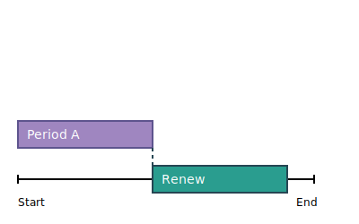
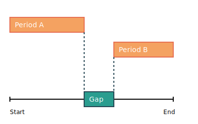

# Date Time Period &mdash; `datetimeperiod`

This package helps you work with dates and times in a more flexible way. It lets you:

- Compare multiple time periods at once
- Find out when different time periods overlap
- Calculate the gaps between time periods
- Do basic comparisons between two time periods

`DateTimePeriod` objects are always immutable, ensuring that input dates remain unchanged and
operations does not cause side effects.

> This package is still a **work in progress**.

## Installation

You can pull the dependency from the central Maven repositories:

```xml

<dependency>
  <groupId>dev.nextgin.commons</groupId>
  <artifactId>datetimeperiod</artifactId>
  <version>0.2.0</version>
</dependency>
```

## Usage

The `DateTimePeriod` methods:

### Creating periods

Create period with specific date-times and precision:

```java
DateTimePeriod period = DateTimePeriod.make(
        LocalDateTime.of(2024, 1, 1, 9, 30),
        LocalDateTime.of(2024, 1, 1, 17, 45),
        Precision.MINUTE
);
```

Create period with default `SECOND` precision:

```java
DateTimePeriod period = DateTimePeriod.make(
        LocalDateTime.of(2024, 1, 1, 9, 30),
        LocalDateTime.of(2024, 1, 1, 17, 45)
);
```

Create period using dates (automatically uses `DAY` precision):

```java
DateTimePeriod period = DateTimePeriod.make(
        LocalDate.of(2024, 1, 1),
        LocalDate.of(2024, 1, 5)
);
```

### `boolean overlapsWith(DateTimePeriod period)`

Whether a period overlaps with another period.

```java
DateTimePeriod morning = DateTimePeriod.make(
        LocalDateTime.of(2024, 1, 1, 9, 0),
        LocalDateTime.of(2024, 1, 1, 12, 0)
);

DateTimePeriod midday = DateTimePeriod.make(
        LocalDateTime.of(2024, 1, 1, 11, 0),
        LocalDateTime.of(2024, 1, 1, 14, 0)
);

boolean overlaps = morning.overlapsWith(midday); // returns true
```

### `boolean touchesWith(DateTimePeriod period)`

Whether a period touches with another period. Two periods touch if the end of one period is
exactly the start of the other.

```java
DateTimePeriod period1 = DateTimePeriod.make(
        LocalDate.parse("2024-01-01"),
        LocalDate.parse("2024-01-05")
);

DateTimePeriod period2 = DateTimePeriod.make(
        LocalDate.parse("2024-01-05"),
        LocalDate.parse("2024-01-31")
);

boolean touches = period1.touchesWith(period2); // returns true
```

```java
DateTimePeriod period1 = DateTimePeriod.make(
        LocalDate.parse("2024-01-01"),
        LocalDate.parse("2024-01-05")
);

DateTimePeriod period2 = DateTimePeriod.make(
        LocalDate.parse("2024-01-02"),
        LocalDate.parse("2024-01-31")
);

boolean touches = period1.touchesWith(period2); // returns false
```

```java
DateTimePeriod period1 = DateTimePeriod.make(
        LocalDate.parse("2024-01-01"),
        LocalDate.parse("2024-01-05")
);

DateTimePeriod period2 = DateTimePeriod.make(
        LocalDate.parse("2024-01-07"),
        LocalDate.parse("2024-01-31")
);

boolean touches = period1.touchesWith(period2); // returns false
```

### `DateTimePeriod renew()`

Renew creates a new period instance with the same duration as the current one,
starting from the end.



```java
DateTimePeriod period = DateTimePeriod.make(
        LocalDate.parse("2024-01-01"),
        LocalDate.parse("2024-01-05")
);

DateTimePeriod renew = period.renew();
// renew represents [2024-01-06T00:00, 2024-01-10T00:00]
```

### `boolean contains(LocalDateTime localDateTime)`

Whether a period contains a specified point in time.

```java
DateTimePeriod workday = DateTimePeriod.make(
        LocalDateTime.of(2024, 1, 1, 9, 0),
        LocalDateTime.of(2024, 1, 1, 17, 0)
);

LocalDateTime lunchtime = LocalDateTime.of(2024, 1, 1, 12, 30);
boolean containsTime = workday.contains(lunchtime); // returns true

LocalDateTime evening = LocalDateTime.of(2024, 1, 1, 19, 0);
boolean containsEvening = workday.contains(evening); // returns false
```

### `boolean contains(DateTimePeriod period)`

Whether a period fully contains another period.

```java
DateTimePeriod workday = DateTimePeriod.make(
        LocalDateTime.of(2024, 1, 1, 9, 0),
        LocalDateTime.of(2024, 1, 1, 17, 0)
);

DateTimePeriod morning = DateTimePeriod.make(
        LocalDateTime.of(2024, 1, 1, 9, 0),
        LocalDateTime.of(2024, 1, 1, 12, 0)
);

boolean containsMorning = workday.contains(morning); // returns true

DateTimePeriod evening = DateTimePeriod.make(
        LocalDateTime.of(2024, 1, 1, 16, 0),
        LocalDateTime.of(2024, 1, 1, 22, 0)
);
boolean containsEvening = workday.contains(evening); // returns false
```

### `DateTimePeriod gap(DateTimePeriod period)`

Calculates the gap between two periods.



```java
DateTimePeriod period1 = DateTimePeriod.make(
        LocalDate.parse("2024-01-01"),
        LocalDate.parse("2024-01-05")
);

DateTimePeriod period2 = DateTimePeriod.make(
        LocalDate.parse("2024-01-10"),
        LocalDate.parse("2024-01-31")
);

DateTimePeriod gap = period1.gap(period2);
// gap represents [2024-01-06T00:00, 2024-01-09T00:00]
```

### `DateTimePeriod overlap(DateTimePeriod period)`

Overlap of two periods.


```java
DateTimePeriod period1 = DateTimePeriod.make(
        LocalDate.parse("2024-01-05"),
        LocalDate.parse("2024-01-20")
);

DateTimePeriod period2 = DateTimePeriod.make(
        LocalDate.parse("2024-01-01"),
        LocalDate.parse("2024-01-15")
);

DateTimePeriod overlap = period1.overlap(period2);
// overlap represents [2024-01-05T00:00, 2024-01-15T00:00]
```

### `DateTimePeriod overlapAll(DateTimePeriod... periods)`

Finds the overlapping period that is common to all provided periods. If there is no single period
that overlaps with all others, returns null.


```java
DateTimePeriod period1 = DateTimePeriod.make(
        LocalDate.parse("2024-01-05"),
        LocalDate.parse("2024-01-20")
);

DateTimePeriod period2 = DateTimePeriod.make(
        LocalDate.parse("2024-01-01"),
        LocalDate.parse("2024-01-15")
);

DateTimePeriod period3 = DateTimePeriod.make(
        LocalDate.parse("2024-01-10"),
        LocalDate.parse("2024-01-31")
);

DateTimePeriod overlapAll = period1.overlapAll(period2, period3);
// overlapAll represents [2024-01-10T00:00, 2024-01-15T00:00]
```

### `DateTimePeriodCollection overlapAny(DateTimePeriod... periods)`

Finds all overlapping periods among the provided periods. When two or more periods overlap, the
overlapping period is added to the result collection.


```java
DateTimePeriod period1 = DateTimePeriod.make(
        LocalDate.parse("2024-01-20"),
        LocalDate.parse("2024-01-31")
);

DateTimePeriod period2 = DateTimePeriod.make(
        LocalDate.parse("2024-01-01"),
        LocalDate.parse("2024-01-10")
);

DateTimePeriod period3 = DateTimePeriod.make(
        LocalDate.parse("2024-01-05"),
        LocalDate.parse("2024-01-25")
);

DateTimePeriod overlapAny = period1.overlapAny(period2, period3);
// [[2024-01-05, 2024-01-10], [2024-01-20, 2024-01-25]]
```

### `DateTimePeriodCollection subtract(DateTimePeriod period)`

Subtracts a period from another period. It returns a collection containing the remaining
non-overlapping periods.


```java
DateTimePeriod period1 = DateTimePeriod.make(
        LocalDate.parse("2024-01-01"),
        LocalDate.parse("2024-01-31")
);

DateTimePeriod period2 = DateTimePeriod.make(
        LocalDate.parse("2024-01-15"),
        LocalDate.parse("2024-01-20")
);

DateTimePeriodCollection subtract = period1.subtract(period2);
// [[2024-01-01, 2024-01-14], [2024-01-21, 2024-01-31]]
```

### `DateTimePeriodCollection subtractAll(DateTimePeriod... periods)`

Subtract multiple periods from a period, returning a collection containing the remaining
non-overlapping periods.


```java
DateTimePeriod a = DateTimePeriod.make(
        LocalDate.parse("2024-01-15"),
        LocalDate.parse("2024-01-31")
);
DateTimePeriod b = DateTimePeriod.make(
        LocalDate.parse("2024-01-01"),
        LocalDate.parse("2024-01-20")
);
DateTimePeriod c = DateTimePeriod.make(
        LocalDate.parse("2024-01-15"),
        LocalDate.parse("2024-01-25")
);

DateTimePeriodCollection subtractAll = a.subtractAll(b, c);
// subtractAll represents [[2024-01-26, 2024-01-31]]
```

---

The `DateTimePeriodCollection` methods:

### Creating collections

Create a new collection from the given periods:

```java
DateTimePeriod period = DateTimePeriod.make(
        LocalDateTime.of(2024, 1, 1, 9, 30),
        LocalDateTime.of(2024, 1, 1, 17, 45),
        Precision.MINUTE
);

DateTimePeriodCollection collection = DateTimePeriodCollection.of(period, period);
```

Create a new collection from the given `Collection` of periods.

```java
DateTimePeriod period = DateTimePeriod.make(
        LocalDateTime.of(2024, 1, 1, 9, 30),
        LocalDateTime.of(2024, 1, 1, 17, 45),
        Precision.MINUTE
);

List<DateTimePeriod> list = List.of(period, period, period);
DateTimePeriodCollection collection = DateTimePeriodCollection.of(list);
```

Create an empty collection:

```java
DateTimePeriodCollection emptyCollection = DateTimePeriodCollection.empty();
```

Create an empty collection when given collection is `null`:

```java
DateTimePeriodCollection emptyCollection = DateTimePeriodCollection.emptyIfNull(
        null); // new empty instance
DateTimePeriodCollection collection = DateTimePeriodCollection.emptyIfNull(
        DateTimePeriodCollection.of(period)); // return the given collection [period]
```

### `DateTimePeriodCollection overlapAll(DateTimePeriodCollection... collections)`

Calculate the overlap of all periods across the given collections.


```java
DateTimePeriod a1 = DateTimePeriod.make(
        LocalDate.parse("2024-01-01"),
        LocalDate.parse("2024-01-20")
);
DateTimePeriod a2 = DateTimePeriod.make(
        LocalDate.parse("2024-01-25"),
        LocalDate.parse("2024-01-31")
);
DateTimePeriodCollection a = DateTimePeriodCollection.of(a1, a2);

DateTimePeriodCollection b = DateTimePeriodCollection.of(DateTimePeriod.make(
        LocalDate.parse("2024-01-01"),
        LocalDate.parse("2024-01-28")
));

DateTimePeriodCollection c = DateTimePeriodCollection.of(DateTimePeriod.make(
        LocalDate.parse("2024-01-10"),
        LocalDate.parse("2024-02-20")
));

DateTimePeriodCollection result = a.overlapAll(b, c);
// result represents [[2024-01-10, 2024-01-20], [2024-01-25, 2024-01-28]]
```

### `DateTimePeriod boundaries()`

Calculate the boundary period that encompasses all periods in the collection.


```java
DateTimePeriodCollection current = DateTimePeriodCollection.of(
        DateTimePeriod.make(LocalDate.parse("2024-01-15"), LocalDate.parse("2024-01-31")),
        DateTimePeriod.make(LocalDate.parse("2024-01-01"), LocalDate.parse("2024-01-20")),
        DateTimePeriod.make(LocalDate.parse("2024-03-01"), LocalDate.parse("2024-03-31"))
);

DateTimePeriod boundaries = a.boundaries();
// boundaries represents [2024-01-01, 2024-03-31]
```

### `DateTimePeriodCollection subtract(DateTimePeriod... periods)`

Subtract the specified periods from the collection.


```java
// Collection A
DateTimePeriod a1 = DateTimePeriod.make(
        LocalDate.parse("2024-01-01"),
        LocalDate.parse("2024-01-10")
);
DateTimePeriod a2 = DateTimePeriod.make(
        LocalDate.parse("2024-01-20"),
        LocalDate.parse("2024-01-31")
);
DateTimePeriodCollection a = DateTimePeriodCollection.of(a1, a2);


// Collection B
DateTimePeriod b1 = DateTimePeriod.make(
        LocalDate.parse("2024-01-05"),
        LocalDate.parse("2024-01-15")
);
DateTimePeriod b2 = DateTimePeriod.make(
        LocalDate.parse("2024-01-25"),
        LocalDate.parse("2024-01-28")
);
DateTimePeriodCollection b = DateTimePeriodCollection.of(b1, b2);

// Result
DateTimePeriodCollection subtract = a.subtract(b);
// subtract represents [[2024-01-01, 2024-01-04], [2024-01-20, 2024-01-24], [2024-01-29, 2024-01-31]]
```

### `DateTimePeriodCollection gaps()`

Calculate the gaps between the periods in a collection.


```java
// Collection A
DateTimePeriod a1 = DateTimePeriod.make(
        LocalDate.parse("2024-01-01"),
        LocalDate.parse("2024-01-10")
);
DateTimePeriod a2 = DateTimePeriod.make(
        LocalDate.parse("2024-01-15"),
        LocalDate.parse("2024-01-20")
);
DateTimePeriod a3 = DateTimePeriod.make(
        LocalDate.parse("2024-01-25"),
        LocalDate.parse("2024-01-31")
);
DateTimePeriodCollection collection = DateTimePeriodCollection.of(a1, a2);

// Result
DateTimePeriodCollection gaps = a.gaps();
// gaps represents [[2024-01-11, 2024-01-14], [2024-01-21, 2024-01-24]]
```

### Testing

```bash
./mvnw verify
```

### Changelog

Please see [CHANGELOG](CHANGELOG.md) for more information on what has changed recently.

### Security

If you discover any security related issues, please
email [contact@nextgin.dev](mailto:contact@nextgin.dev) instead of using
the issue tracker.

## Credits

- [Othmane OUTAMA](https://github.com/ooutama)
- [All Contributors](../../contributors)

## Support us

## License

The MIT License (MIT). Please see [License File](LICENSE) for more information.
